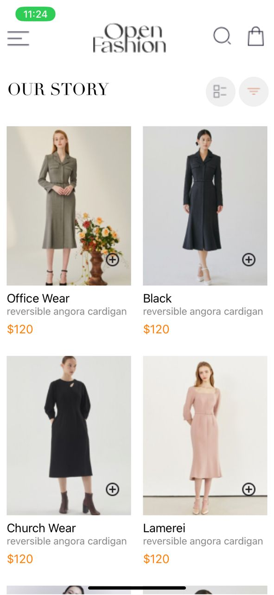
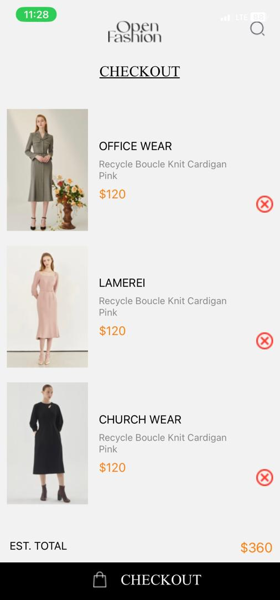

# rn-assignment6-11156875
1. Home Screen Component: 
This screen displays a list of available products with an "Add to Cart" button for each product.

2. Cart Screen Component:
This screen displays selected items with a "Remove from Cart" button for each item.

3. AsyncStorage for Local Storage:
It stores selected items locally on the device.

4. Screenshots:

HomeScreen:

CartScreen:
